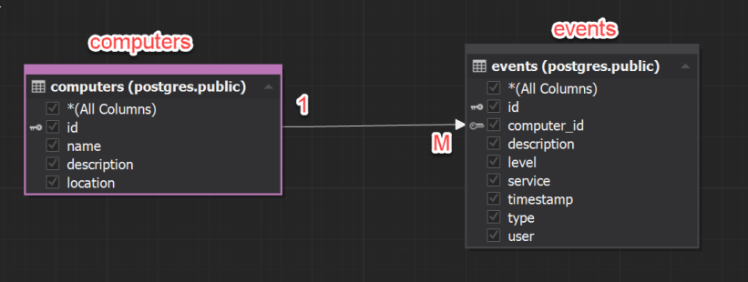
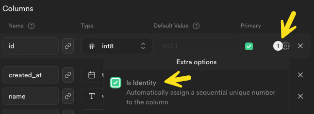
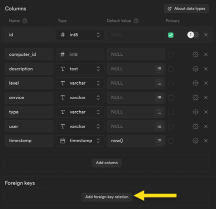
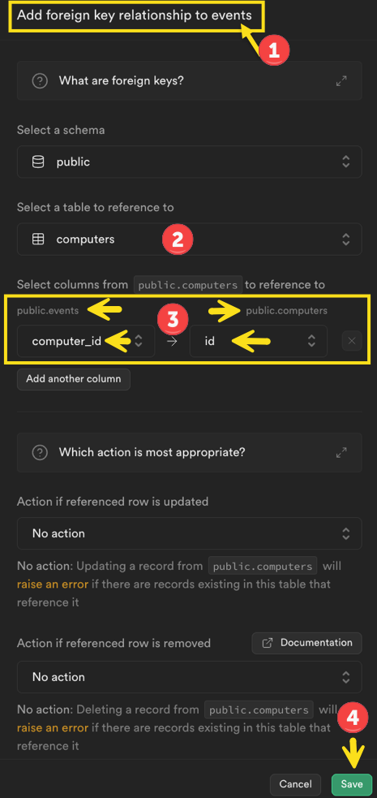

# Setting up Supabase for the Year 2 Project


## Introduction

The project will need a database which will be used to:

1.  Store data generated by the **MQTT scripts**

2.  Act as a data source for the **website**.

We will be using a Relational SQL database as that is what you are most familiar with at this point.

Usually a server-side web API would also be required to manage access to the database. To avoid this extra complexity, we will use Supabase. This is a cloud-based service which provides a free database and ‘serverless’ access via web (HTTP) requests.

## Setting up a Supabase account

Supabase is free to use for small projects and you can sign up using your GitHub account. 
It is also very well documented.

To set up your account, visit **<https://supabase.com/>** and create an account using your student email account.


## The database ERD

To get started and test Supabase, this example will demonstrate how to setup an application to log events in a computer network. The database will use two tables: **computers** and **events**, where a computer can have **One to Many** events. Later we will send events for a particular computer via an MQTT script and store them in the DB.




## Create a new database

### 1. A new Supabase Project for the database

After logging in choose **New Project** from the dashboard.


### 2. Add the new project to your ‘organisation’


### 3. Fill in the details


### 4. Wait for setup to complete


## Add tables to the database

Once setup has completed, the welcome page will display.

### 1. Choose the ‘table editor’


## Add the computers table

Add a new table to the **public** schema


### 1. Add the columns and set the data types as shown below. Set the id column as Primary Key


 

### 2. Set column attributes

Id should be set as an identity column so that it auto increments as rows are
added




Null values should *not be allowed* for **name** and **location**


### 3. Save the table

Don’t for get to do this after editing the table after each change.


## Add the Events table

### 1. Add a new table named events

Name the columns and set data types as below. Set id as the primary key.

Use the settings icon to set id as an identity and the other columns as not
nullable.


### 2. Set computer_id as a foreign key

This column will reference the id column in the computers table.



Click the link icon next to **computer_id**, then create the foreign key
relation:



### 3. Review in the Supabase dashboard

At this point you should have a database with two tables.


## SQL in Supabase

The database you created runs on PostgreSQL which is like Oracle and other relational databases. Just like the others, PostgreSQL supports SQL for working with database relations.

### 1. Open the query editor

In the Supabase console/ dashboard, open the SQL Editor using its icon:


The welcome page provides help and sample SQL for common tasks. To run your own
SQL, choose **+ New query**

### 2. SQL to select all computers

After the new query windows opens, enter the SQL to **```sql select * from computers```**. Then run the query.


### Sample data

You won’t have any results to display until some data is added. 

You can use the following SQL to insert some same data (note no id values as this is generated during insert):

``` sql
INSERT INTO computers(name, description, location) VALUES
('PC-121-01', 'Windows 10 PC', 'room 121');
INSERT INTO computers(name, description, location) VALUES
('WWW', 'Web Server', 'Server Room');
INSERT INTO computers(name, description, location) VALUES
('PostgreSQL Server', 'Database server', 'Server Room');
INSERT INTO computers(name, description, location) VALUES
('File Server', 'Office file server', 'Server Room');

INSERT INTO events(computer_id, description, level, service, type, "user") VALUES
(1, 'restart required', 'warning', 'windows update', 'system', 'system');
INSERT INTO events(computer_id, description, level, service, type, "user") VALUES
(2, 'The service was restarted', 'information', 'httpd', 'service', 'www');
INSERT INTO events(computer_id, description, level, service, type, "user") VALUES
(3, 'crash', 'error', 'postgres', 'service', 'database');
INSERT INTO events(computer_id, description, level, service, type, "user") VALUES
(4, 'updates installed', 'information', 'file', 'system update', 'system');
```


After inserting, try  **```select * from computers ```** again


------

**Enda Lee 2024**
